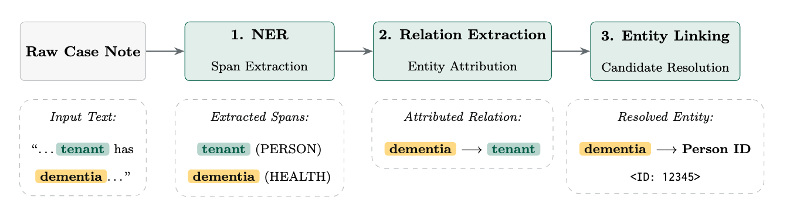

# Production Inference

This folder contains the production batch execution pipeline for extracting Additional Needs from housing case notes. Loads trained model artifacts and writes validated, partitioned Parquet/JSON predictions.

> **Note:** Research and training code reside in `dev/`. Keep production execution changes inside `inference/`.

---

## 1. Architecture Overview

The pipeline processes case notes through 3-stages:





* **NER (Span Classifier):** Identifies text mentions (`person_name`, `person_role`, or `need_category`).
* **RE (Relation Classifier):** Pairs need mentions with person mentions within the same note.
* **EL (Entity Linker):** Deterministic business logic mapping predicted person mentions to actual household member IDs (excludes minors <18; falls back to `tenure_id` if unlinked).

---

## 2. Directory & Module Mapping

| To change / debug... | Edit this module |
| :--- | :--- |
| **Span Extraction (NER)** | `src/classifiers/span_classifier.py` |
| **Relation Extraction (RE)** | `src/classifiers/relation_classifier.py` |
| **Linking & Business Rules (EL)** | `src/classifiers/entity_linker.py` |
| **Input/Output Schemas** | `src/schemas.py` |
| **Batching & Model Loading** | `src/run_inference.py` |

---

## 3. Data Schemas

### Input Expectation (`*.json`)
```json
{
  "id": "note-123",
  "text": "Mrs Smith requires ground-floor accommodation.",
  "tenure_ids": ["tenure-456"],
  "household_members": [{"id": "person-789", "fullName": "Mrs Smith", "dateOfBirth": "1980-01-01"}]
}

```

### Output Format (`part_*.json` / Parquet)

```json
{
  "id": "note-123",
  "needs": [...],
  "persons": [...],
  "relations": [...],
  "links": [{"target_id": "person-789", "target_type": "person", "method": "fuzzy_name"}],
  "pipeline_run_at": "2026-10-07T16:00:00Z"
}

```

---

## 4. Troubleshooting Recommendations

| Symptom | Primary Check | Action |
| --- | --- | --- |
| **Job fails immediately** | Model path / S3 URIs | Verify `<model_root>/span/final_model/` and `relation/final_model/` exist. |
| **Empty output directory** | Input file discovery | Confirm input folder contains valid `*.json` records. |
| **Spans empty (`needs`/`persons`)** | Thresholds & Labels | Check confidence thresholds and input text formatting in `span_classifier.py`. |
| **Relations empty** | Span co-occurrence | Ensure both a `need` and a `person` span exist in the same note. |
| **All links fall back to tenure** | Linking rules / Household data | Check `dateOfBirth` (<18 filter) or fuzzy match score in `entity_linker.py`. |
| **GPU OOM Errors** | Memory allocation | Lower `batch_size` or max token sequence length in `run_inference.py`. |

---

## 5. Local Execution & Docker

```bash
# Run unit tests
pip install -e .[dev]
pytest tests/

# Test entrypoint locally
python src/run_inference.py --input-dir ./data/sample --output-dir ./data/output

# Docker Build & Test
docker build -t housing-additional-needs-ml .
docker run --rm -v $(pwd)/data:/app/data housing-additional-needs-ml

```